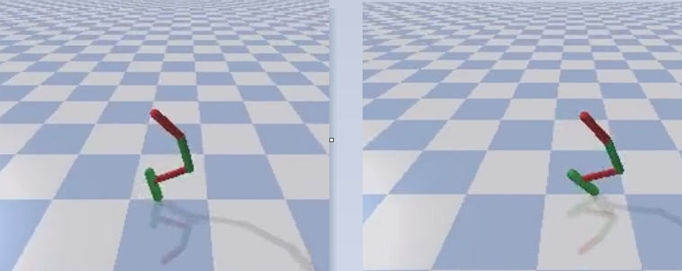

# Project - HopperBulletEnv with Soft Actor-Critic (SAC)

### Environment  

Solving the environment require an average total reward of over **2500** on 100 consecutive episodes.    
Training of HopperBulletEnv is performed using the __Soft Actor-Critic (SAC)__ algorithm, see    
two basic papers [SAC: Off-Policy Maximum Entropy Deep RL with a Stochastic Actor](https://arxiv.org/abs/1801.01290)     
and [SAC Algorithms and Applications](https://arxiv.org/abs/1812.05905).  We solve the HopperBulletEnv environment in **7662 episodes**. 

### Tips to class GaussianPolicy

#### Scale and Bias 

   The varaible _scale_ is the length of the interval [low, high]:     
     _scale = (action_space.high - action_space.low)/2_     
   
   The varaible  _bias_  is the center of  the interval [low, high]:    
    _bias =  (action_space.high + action_space.low)/2_   
    
   These values give the map  [low, high]  --> [(low - bias)/scale, (high - bias)/scale] = [-1,1].  
   
 #### Activation Function
 
 The **hyperbolic tangent function** torch.tanh is very similar to  the [sigmoid function](https://en.wikipedia.org/wiki/Sigmoid_function).    
 However, the range of _sigmoid function_ is [0,1] and the range of _tanh_ is [-1,1].   
 
    
 
 Then _tanh_ is should be more efficient because it has a wider range, and derivative is more steep,       
 see [Comparison of Activation Functions for Deep Neural Networks](https://towardsdatascience.com/comparison-of-activation-functions-for-deep-neural-networks-706ac4284c8a). 
 
 #### Reparameterization
 
 
 
 see [Auto-Encoding Variational Bayes](https://arxiv.org/abs/1312.6114) by D.Kingma, M.Welling
       

### Learning Curve

The score 2500 was achieved in the episode **7662** after training **89 hours 23 minutes**.

### Video
See video [Lucky Hopper](https://www.youtube.com/watch?v=Ipctq89yLB0) on youtube.
