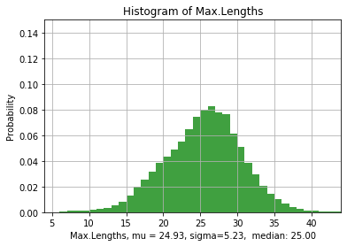
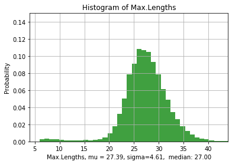

# Project - Snake with Deep Q-Network, Pytorch, Pygame

### Rewards

The total reward is calculated for each episode, which is continued for 30 games.   
We collect average total reward for every 100 consecutive episodes. The threshold is unknown.    
The snake's length and reward increase by 1 each time an apple is eaten.    
The reward is reduced by 1 every time the snake collides with itself,    
bumps into the border of the board, or if it does not eat an apple for a long time. 

### Actions
0 - turn left,  1 - turn right, 2 - move up, 3 - move down

### Other DQN projects

[_Cartpole_](https://github.com/Rafael1s/Deep-Reinforcement-Learning-Udacity/edit/master/Cartpole-Deep-Q-Learning), 2 discrete actions are available:  
0 - push cart to the left, 1 - push cart to the right.     
[_Navigation_](https://github.com/Rafael1s/Deep-Reinforcement-Learning-Udacity/tree/master/Project-1_Navigation-DQN), 4 discrete actions are available:     
0 - move forward, 1 - move backward, 2 - turn left, 3 - turn right.    
[_LunarLaunder_](https://github.com/Rafael1s/Deep-Reinforcement-Learning-Udacity/new/master/LunarLander-v2-DQN), 4 discrete actions are available:  
 0 - do nothing, 1 - fire left orientation engine, 2 - fire main engine,  3 - fire right orientation engine.   
 
 ### Snake's Length
 
 For any 100 consecutive episodes we get value 'Avg.LenOfSnake' adn 'Max.LenOfSnake'.
 
 1.  For Learning rate = 1e-4, and number of episodes = 50000      
 Avg.LenOfSnake = 18,  Max.LenOfSnake = 46    
 
     
 
 2.  For Learning rate = 1e-5, and number of episodes = 60000    
 Avg.LenOfSnake = 18,  Max.LenOfSnake = 44    
 
     
 
